GTC 2026 is in the books and it was certainly an interesting year. The exhibit hall was jam packed and spilled over to an outdoor space where my employer (ScaleFlux) had a booth. This coincided with an unusual March heatwave in San Jose, but NVIDIA made the best of it by bringing in a (free) Mr. Softee truck and plenty of umbrellas. 

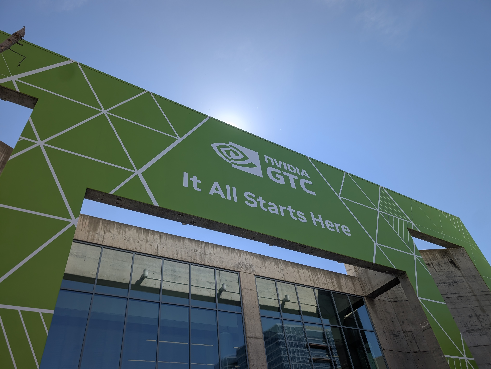
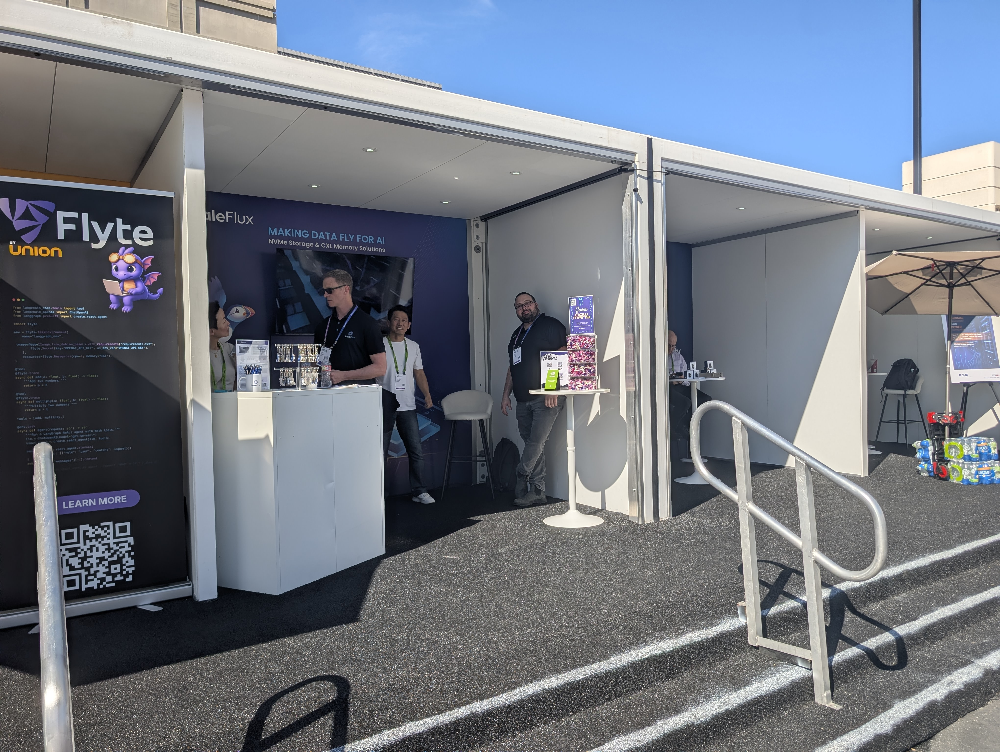

We were even visited by the Boston Dynamics dog, which is absolutely terrifying to anyone who say _that_ Black Mirror episode.

On a less dystopian note, I had the pleasure this year of working with LightBits Labs and FarmGPU demonstrating Lightbits' LightInferra KV Cache solution running on ScaleFlux NVMe SSDs in FarmGPU's cloud. Unlike naive caching solutions, LightInferra plugs into the attention mechanism (they call it "Sub-Linear Sparse Attention Prefetch") to promote KV Cache entries ahead of demand. You can read more about this work [here](https://www.lightbitslabs.com/blog/introducing-lightinferra-280x-improved-ai-token-economy-by-lightbits-labs/). In a very small nutshell, this platform enables high performance (and economical) long context inferencing. We brought a few of our devices for show and tell (E1.S not shown, but we had those there as well).

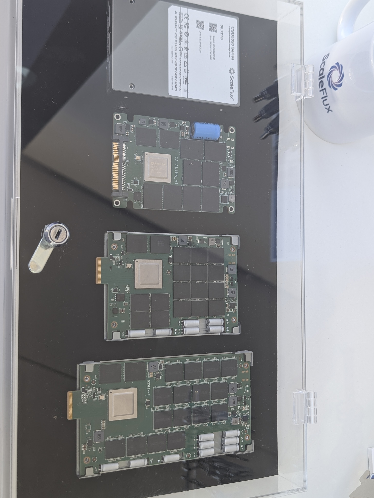

But turning focus back to the show itself, this was clearly the year of Vera Rubin, combing Vera CPUs (88 cores each) and Rubin GPUs. Here are some of those platforms on display:

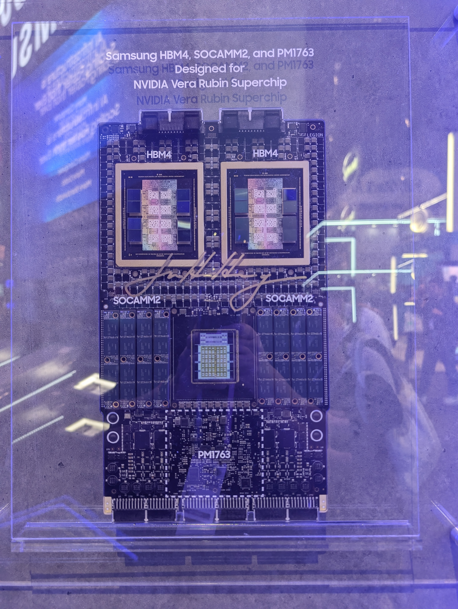

Bluefield4-based storage systems (for KV-Cache) were also quite prominent. Most notable here is that they all use E3.S SSDs whereas GPU trays/servers remain on E1.S.

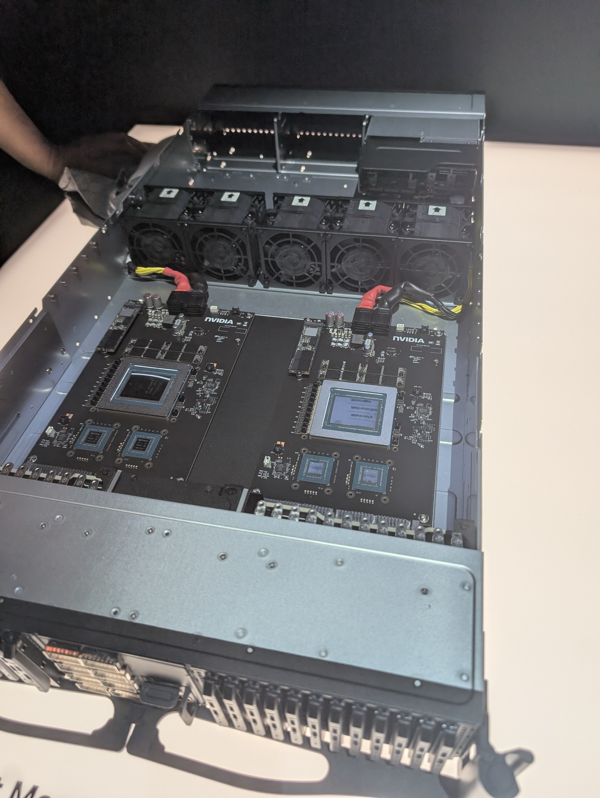
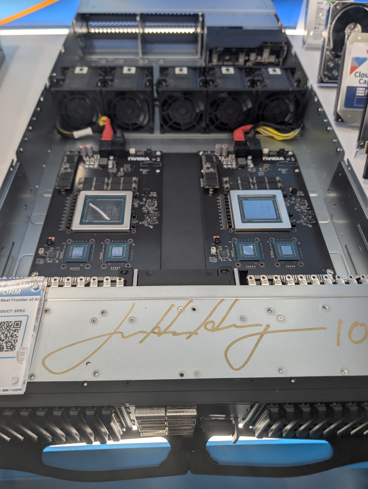

Not to leave out networking, some nice 800Gb switches (both ethernet and Infiniband) were on display in the NVIDIA booth. I only took a snap of the Infiniband optical switch, which brought the optical signals right to the switch chip.

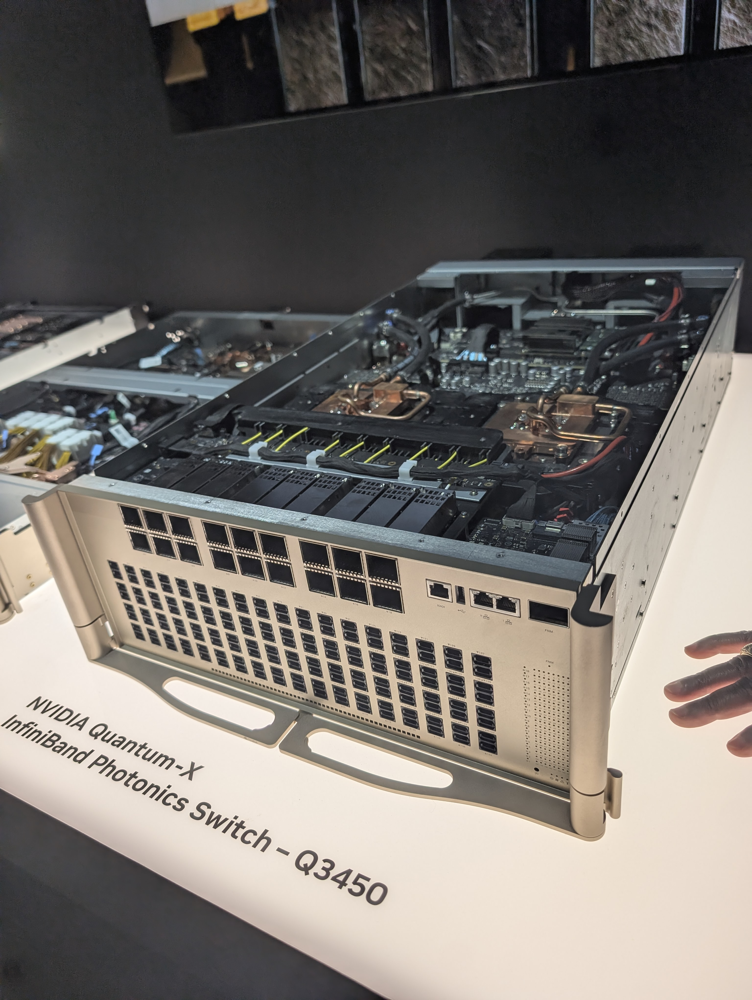

I didn't quite get too many rack-level pictures, but here is a Vera Rubin NVL72 (72 GPUs connected with NVLink and 144 Rubin CPUs) and a Blackwell-based "A4 Max" rack from Google (which you can rent in their cloud):

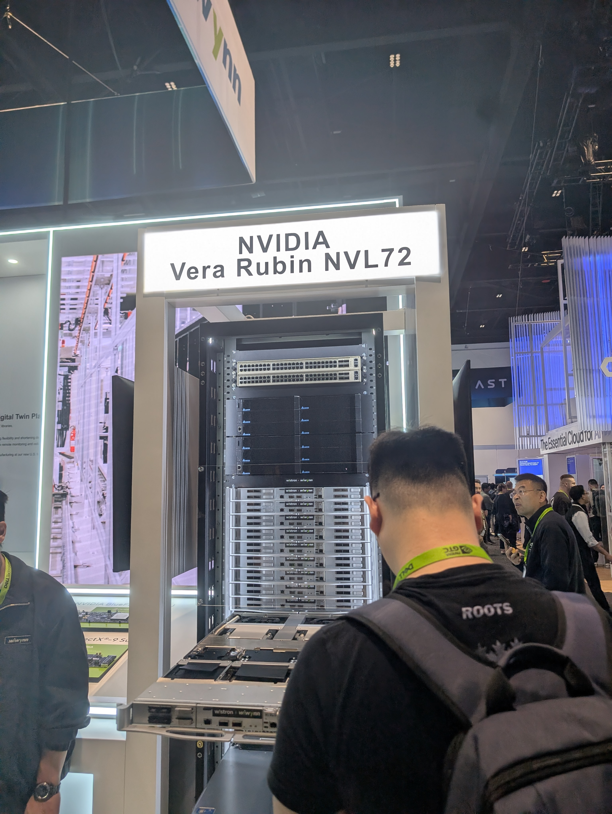
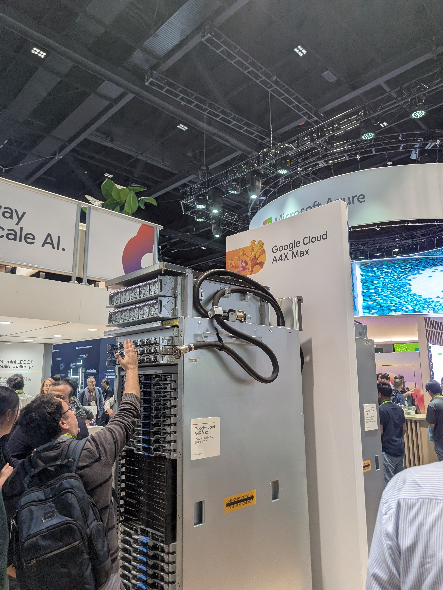

Of course, there were many other things to see. Being a memory geek at heart, the HBM4 and NAND wafers brought by various vendors were neat to look at.

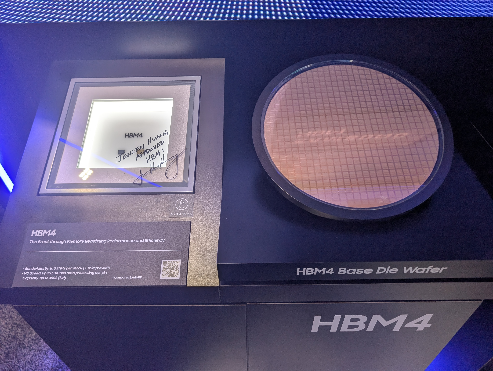
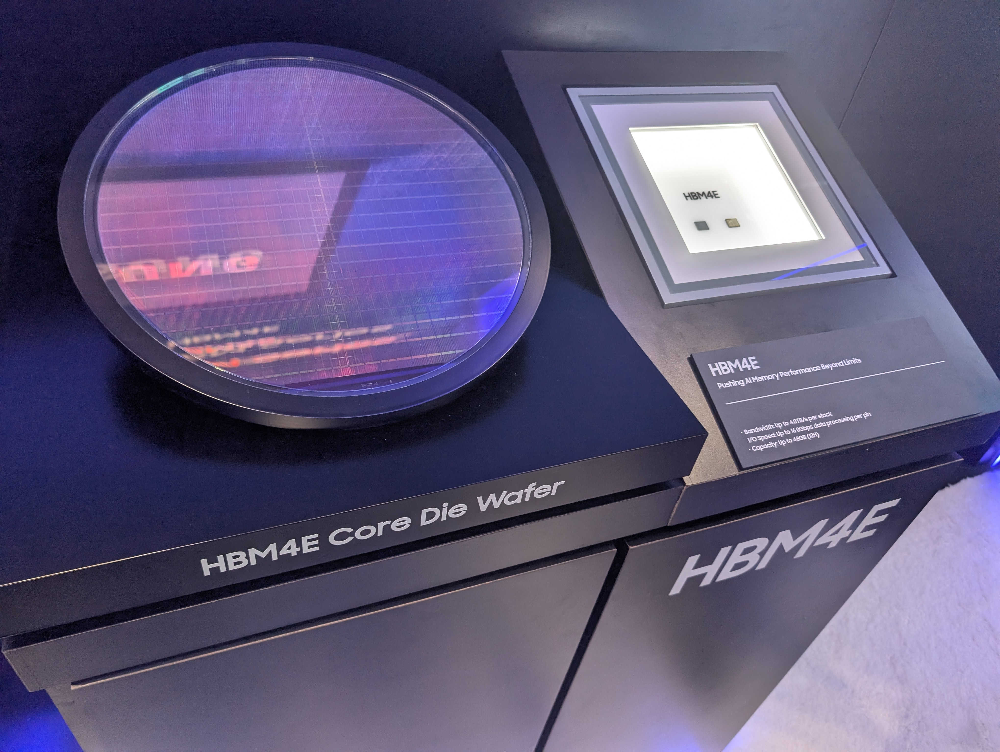
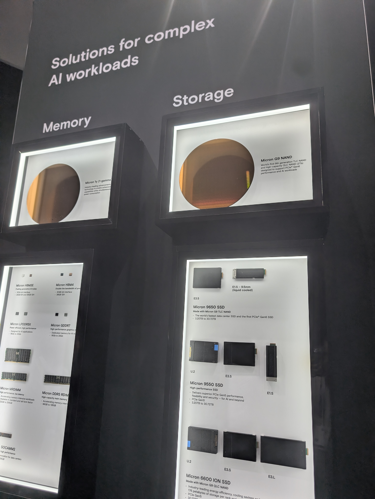

There were no shortage of robots (although I thought physical AI was a heavier point of emphasis last year).

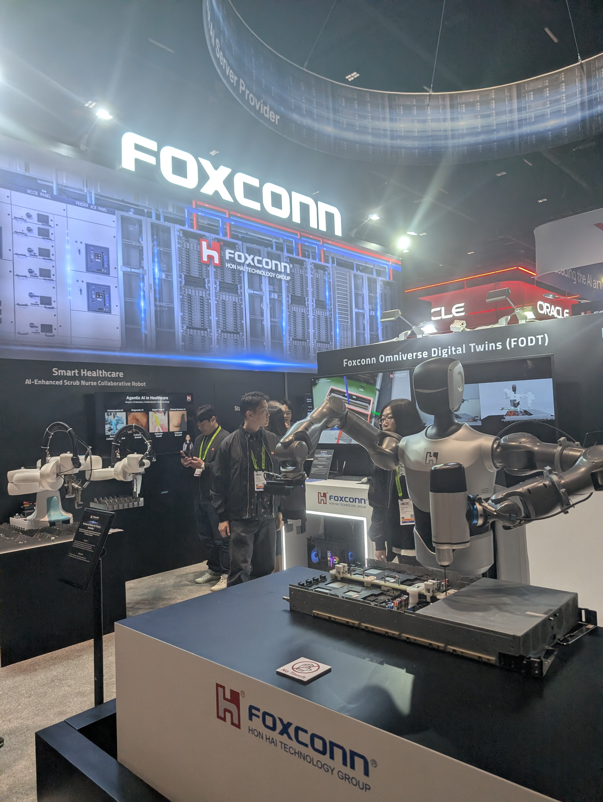

Although nothing has been announced, I expect GTC 2027 to change venues. It is bursting at the seems. Hopefully I will see you there (in Vegas?).
